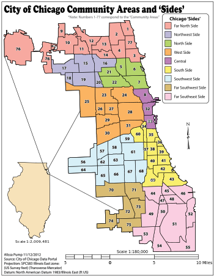

```{r setup, include=FALSE}
knitr::opts_chunk$set(echo = FALSE)
```

```{r load-packages, message = FALSE}
library(tidyverse)
library(broom)
```

## Introduction

Since 1990, crime rates in the 30 biggest cities in America has dropped 64%.
However, from 2014 to 2016, crime rates across America rose significantly, with
the biggest increase in violent crime (10.6% rise from 2014 to 2015). This crime
problem was addressed by Donald Trump in his 2016 presidential run, and a big
part of his "Make America Great Again" campaign. 

Of course, it is extremely important that our policymakers and law enforcement
officials do their best to keep the American public safe. Of equal importance to
reducing crime is making arrests when crime does occur. We can use data science
to help us begin to tackle this issue. 

By looking at data on crimes and arrests, we can identify the factors that are
the biggest indicators to predicting whether an arrest is made. Using insights
gained from this analysis, we can make the criminal justice system more
efficient/effective in arresting and prosecuting criminals or reducing crime
rates. For example, if one trend in the data shows a disproportionately low
amount of arrests being made during the winter months, a city can increase the
number of officers on patrol during winter. In addition, if another trend in the
data is showing a very small proportion of arrests being made in domestic
violence cases as compared to other crime types, then a city can make changes to
the way domestic violence crimes are reported to and processed by law
enforcement. Consequently, if more arrests are made, this may deter criminals
from committing a crime in the future, lowering crime rates. Essentially, looking
at which factors are attributed to an arrest can allow law enforcement and
policymakers to see the strengths and weaknesses of the current system, and act
to improve it accordingly. 

For the purposes of data analysis, in this project we will focus specifically on
crime statistics in Chicago, since there is not enough data to accurately predict
uniform crime trends across the US. As one of the largest cities in the US,
Chicago also has one of the highest rates of crime in the US, meaning that it will
be a relevant microcosm for us to conduct our study.

Thus, in this project, we will be answering the question: What factors are the
biggest indicators to predict arrests in the city of Chicago? Specifically, we
will be analyzing and focusing on the factors in the dataset that are attributed
to the highest proportion of arrests.

The dataset we will be looking at to investigate this question is the "Crimes -
2018" dataset from the Chicago Data Portal. The data itself is a csv file with
229,359 observations across 22 variables; and the 2018 data is a subset of the
larger "Crimes - 2001 to present" original dataset. The data were collected from
the Chicago Police Department's CLEAR (Citizen Law Enforcement Analysis and
Reporting) system. Each observation in the dataset is a separate reported crime
that was committed in the city of Chicago in 2018, while the variables contain
information about the reported crime, such as time, location, type of crime, etc.

## Data Analysis

First, let's load the dataset into R.

```{r load-data, message = FALSE}
crimes <- read_csv(file = "../data/Crimes - 2018.csv")
```

For our analysis, we will primarily be using the `Arrest` variable, which is
coded as True/False, as our response variable. Let's take a look at the initial
distribution of this variable.

```{r arrest-distribution}
ggplot(data = crimes, mapping = aes(x = Arrest)) +
  geom_bar(stat = "count", fill = "Light Blue", color = "Black") +
  labs(title = "Distribution of arrests",
       subtitle = "made in reported crime cases in Chicago (2018)",
       y = "Count")
  
crimes %>%
  select(Arrest) %>%
  count(Arrest) %>% 
  group_by(Arrest) %>%
  summarise(prop = 100*(n/nrow(crimes)))
```

From the visualization above, it is clear that for the vast majority of reported
crime cases, there is no arrest made (~80%). Thus, we are very interested in
determining the factors that are associated with an arrest. For the purposes of
simplicity and efficiency in our data analysis, we will only focus on the
variables `Date`, `Primary.Type`, `Location.Description`, `Domestic`, and
`Community.Area` for our explanatory variables. 

First, let's explore the `Date` variable. 

```{r date-variable}
glimpse(crimes$Date)
```

However, we need to do a couple touch-ups before beginning our data analysis
process. Since the `Date` variable is coded with both the date of the crime as
well as the time it was committed, we can separate the `Date` variable into two
new variables: the month of the crime as well as the time of the crime. This will
help break down the original complex `Date` variable.

```{r newdatemonth}
crimes <- crimes %>% 
  mutate(month = case_when(
    startsWith(Date, "1/") == TRUE                ~ "January",
    startsWith(Date, "2/") == TRUE                ~ "February",
    startsWith(Date, "3/") == TRUE                ~ "March",
    startsWith(Date, "4/") == TRUE                ~ "April",
    startsWith(Date, "5/") == TRUE                ~ "May",
    startsWith(Date, "6/") == TRUE                ~ "June",
    startsWith(Date, "7/") == TRUE                ~ "July",
    startsWith(Date, "8/") == TRUE                ~ "August",
    startsWith(Date, "9/") == TRUE                ~ "September",
    startsWith(Date, "10") == TRUE                ~ "October",
    startsWith(Date, "11") == TRUE                ~ "November",
    startsWith(Date, "12") == TRUE                ~ "December",
  ))
```

```{r newdatetime}
crimes <- crimes %>%
  mutate(time = sapply(strsplit(Date, split=' ', fixed=TRUE), function(x) (x[2])))
```

With our new variables `month` and `time` created, we now have the framework with
which we can begin our data analysis. However, due to the many levels and
subsequent level of specificity (to a degree which is unnecessary for the
purposes of our data analysis) introduced by both the new variables, we can still
break down our data further. We can introduce a new `season` variable to reduce
the number of levels introduced by `month` by grouping January and February under
"Winter", March, April and May under "Spring", June, July, and August under
"Summer", and September, October, and November under "Fall". In addition, we can
create a new `daytime` logical variable which indicates whether the crime was
committed during daytime hours or not. For simplicity, we will classify daytime
hours as between 6AM and 6PM (6:00 - 18:00).

```{r season}
crimes <- crimes %>% 
  mutate(season = case_when(
    month == "January"                         ~ "Winter",
    month == "February"                        ~ "Winter",
    month == "March"                           ~ "Spring",
    month == "April"                           ~ "Spring",
    month == "May"                             ~ "Spring",
    month == "June"                            ~ "Summer",
    month == "July"                            ~ "Summer",
    month == "August"                          ~ "Summer",
    month == "September"                       ~ "Fall",
    month == "October"                         ~ "Fall",
    month == "November"                        ~ "Fall"
  ))
```

```{r daytime}
crimes <- crimes %>%
  mutate(daytime = case_when(
    startsWith(time, "0:") == TRUE         ~ FALSE,
    startsWith(time, "1:") == TRUE         ~ FALSE,
    startsWith(time, "2:") == TRUE         ~ FALSE,
    startsWith(time, "3:") == TRUE         ~ FALSE,
    startsWith(time, "4:") == TRUE         ~ FALSE,
    startsWith(time, "5:") == TRUE         ~ FALSE,
    startsWith(time, "6:") == TRUE         ~ TRUE,
    startsWith(time, "7:") == TRUE         ~ TRUE,
    startsWith(time, "8:") == TRUE         ~ TRUE,
    startsWith(time, "9:") == TRUE         ~ TRUE,
    startsWith(time, "10") == TRUE         ~ TRUE,
    startsWith(time, "11") == TRUE         ~ TRUE,
    startsWith(time, "12") == TRUE         ~ TRUE,
    startsWith(time, "13") == TRUE         ~ TRUE,
    startsWith(time, "14") == TRUE         ~ TRUE,
    startsWith(time, "15") == TRUE         ~ TRUE,
    startsWith(time, "16") == TRUE         ~ TRUE,
    startsWith(time, "17") == TRUE         ~ TRUE,
    startsWith(time, "18") == TRUE         ~ TRUE,
    startsWith(time, "19") == TRUE         ~ FALSE,
    startsWith(time, "20") == TRUE         ~ FALSE,
    startsWith(time, "21") == TRUE         ~ FALSE,
    startsWith(time, "22") == TRUE         ~ FALSE,
    startsWith(time, "23") == TRUE         ~ FALSE,
  ))
```

Now let's take a look at our `Community Area` variable. Similarly as we have done
with the `month` and `time` variables to reduce the number levels, we can also
simplify the `Community Area` variable by creating a new variable `side`, which
classifies all 77 community areas as one "neighborhood" or "side" of Chicago in
accordance to the map below:

```{r map, echo=FALSE, out.width = '100%'}

```

```{r communityside}
crimes <- crimes %>%
  mutate(side = case_when(
  `Community Area` == 1 ~ "Far North",
  `Community Area` == 2 ~ "Far North",
  `Community Area` == 3 ~ "Far North",
  `Community Area` == 4 ~ "Far North",
  `Community Area` == 9 ~ "Far North",
  `Community Area` == 10 ~ "Far North",
  `Community Area` == 11 ~ "Far North",
  `Community Area` == 12 ~ "Far North",
  `Community Area` == 13 ~ "Far North",
  `Community Area` == 14 ~ "Far North",
  `Community Area` == 76 ~ "Far North",
  `Community Area` == 77 ~ "Far North",
  `Community Area` == 15 ~ "Northwest",
  `Community Area` == 16 ~ "Northwest",
  `Community Area` == 17 ~ "Northwest",
  `Community Area` == 18 ~ "Northwest",
  `Community Area` == 19 ~ "Northwest",
  `Community Area` == 20 ~ "Northwest",
  `Community Area` == 5 ~ "North",
  `Community Area` == 6 ~ "North",
  `Community Area` == 7 ~ "North",
  `Community Area` == 21 ~ "North",
  `Community Area` == 22 ~ "North",
  `Community Area` == 23 ~ "West",
  `Community Area` == 24 ~ "West",
  `Community Area` == 25 ~ "West",
  `Community Area` == 26 ~ "West",
  `Community Area` == 27 ~ "West",
  `Community Area` == 28 ~ "West",
  `Community Area` == 29 ~ "West",
  `Community Area` == 30 ~ "West",
  `Community Area` == 31 ~ "West",
  `Community Area` == 8 ~ "Central",
  `Community Area` == 32 ~ "Central",
  `Community Area` == 33 ~ "Central",
  `Community Area` == 34 ~ "South",
  `Community Area` == 35 ~ "South",
  `Community Area` == 36 ~ "South",
  `Community Area` == 37 ~ "South",
  `Community Area` == 38 ~ "South",
  `Community Area` == 39 ~ "South",
  `Community Area` == 40 ~ "South",
  `Community Area` == 41 ~ "South",
  `Community Area` == 42 ~ "South",
  `Community Area` == 43 ~ "South",
  `Community Area` == 60 ~ "South",
  `Community Area` == 69 ~ "South",
  `Community Area` == 61 ~ "Southwest",
  `Community Area` == 62 ~ "Southwest",
  `Community Area` == 63 ~ "Southwest",
  `Community Area` == 64 ~ "Southwest",
  `Community Area` == 65 ~ "Southwest",
  `Community Area` == 66 ~ "Southwest",
  `Community Area` == 67 ~ "Southwest",
  `Community Area` == 68 ~ "Southwest",
  `Community Area` == 56 ~ "Southwest",
  `Community Area` == 57 ~ "Southwest",
  `Community Area` == 58 ~ "Southwest",
  `Community Area` == 59 ~ "Southwest",
  `Community Area` == 45 ~ "Far Southeast",
  `Community Area` == 46 ~ "Far Southeast",
  `Community Area` == 47 ~ "Far Southeast",
  `Community Area` == 48 ~ "Far Southeast",
  `Community Area` == 49 ~ "Far Southeast",
  `Community Area` == 50 ~ "Far Southeast",
  `Community Area` == 51 ~ "Far Southeast",
  `Community Area` == 52 ~ "Far Southeast",
  `Community Area` == 53 ~ "Far Southeast",
  `Community Area` == 54 ~ "Far Southeast",
  `Community Area` == 55 ~ "Far Southeast",
  `Community Area` == 70 ~ "Far Southwest", 
  `Community Area` == 71 ~ "Far Southwest",
  `Community Area` == 72 ~ "Far Southwest",
  `Community Area` == 73 ~ "Far Southwest",
  `Community Area` == 74 ~ "Far Southwest",
  `Community Area` == 75 ~ "Far Southwest"
))
```

Finally, let's take a look at our `Primary Type` and `Location Description`
variables, which both have many levels. For our data analysis, we will only
focus on the main elements of each to increase both the relevance of our
findings as well as the organization and efficiency of our analysis. For `Primary
Type` (crime type), we will only be focusing on the crime types of assault,
battery, criminal sexual assault, homicide, robbery, theft, and other offense.

For `Location Description`, we will only be focusing on the top five locations
where the most incidences of crime occurred - Street, Residence, Apartment,
Sidewalk, and Other. 

```{r toplocation}
crimes %>%
  count(`Location Description`) %>%
  arrange(desc(n)) %>%
  top_n(5)
```

Now, we can filter for only levels of `Primary Type` and `Location Description`
we are interested in and put that data in a new dataframe with which we will
conduct our analysis. This also cuts down the extremely large number of
observations we had to begin with. 

```{r newcrimesdata}
crimesdata <- crimes %>%
  filter(`Location Description` == "STREET" | 
          `Location Description` == "RESIDENCE" |
          `Location Description` == "APARTMENT" |
          `Location Description` == "SIDEWALK" |
          `Location Description` == "OTHER") %>%
  filter(`Primary Type` == "ASSAULT" |
           `Primary Type` == "BATTERY" |
           `Primary Type` == "CRIM SEXUAL ASSAULT" |
           `Primary Type` == "HOMICIDE" |
           `Primary Type` == "ROBBERY" |
           `Primary Type` == "THEFT" |
           `Primary Type` == "OTHER OFFENSE"
           ) %>%
  select(`Case Number`, `Primary Type`, `Location Description`, Arrest, 
         Domestic, month, time, season, daytime, side)

glimpse(crimesdata)
```

With our new crimesdata dataset created, we can begin our analysis process. For
our logistic regression, our response variable is the binary `Arrest` variable,
coded as True/False, and we are interested in cases where an arrest has been made
(`Arrest` = True). Our explanatory variables will be `Primary Type`, `Location
Description`, season, daytime, side, and Domestic. 

Let's start by creating our full logistic regression model. 

```{r fulllogmodel}
fulllog <- glm(Arrest ~ season + daytime + Domestic + `Primary Type` + 
                 `Location Description` + side,
               data = crimesdata, family = "binomial")
summary(fulllog)
```

From our full model, we can see that there are many coefficients in our original
logistic regression. We can perform backward model selection on this model to
try and choose a better model with a lower AIC.

```{r fullmodelaic}
glance(fulllog)$AIC
```

```{r selectedmodel}
selected_model <- step(fulllog, direction = "backward")
tidy(selected_model)
```

From the results of our backwards AIC model selection, our original full model is
still the best logistic regression model of our results. This can be explained by
the fact that most of our variables had multiple levels, and removing that
variable from the full model would also lose a lot of specificity and diversity
in the data, thereby increasing the AIC. 

Knowing this, we can look at the coefficients of our full logistic regression
model to get a better idea of which factors influence our response variables the
most. Looking at the p-values for which specific coefficients are statistically
significant can help us determine the factors that influence an arrest.

However, the current coefficients of our full logistic regression model are the
increase in log odds for an arrest being made per change in explanatory variable,
which is quite hard to conceptualize. Instead, we can exponentiate the
coefficients to make them easier to understand.

```{r factorcoeff}
exp(coef(selected_model))
```

To begin, let's look at the `season` variable. From the summary output, we see
that the odds of a criminal being arrested increase by a factor of 1.08 if they
commit a crime in the spring, 1.06 if they commit a crime in the summer, and over
1.25 if they commit a crime in the winter compared to when they commit a crime in
the fall. However, out of these three seasons, only winter seems to have a
coefficient and subsequent p-value that is small enough to be statistically
significant. If we recall from earlier, January and February are the months to
which we assigned the season winter. Let's take a look at the relative arrest
rates in these two months compared to the yearly average (when looking at
proportions of arrests made, we still use our original crimes dataset because are
interested in the proportions of arrests made in the rest of the population
data).

```{r avgmontharrests}
crimes %>%
  select(month, Arrest) %>%
  group_by(month, Arrest) %>%
  summarise(n = n()) %>%
  mutate(prop = scales::percent(n/sum(n))) %>%
  filter(Arrest == TRUE) %>%
  filter(month == "February" | month == "January") %>%
  arrange(desc(prop))

crimes %>%
  select(Arrest) %>%
  count(Arrest) %>% 
  group_by(Arrest) %>%
  summarise(prop = 100*(n/nrow(crimes))) %>%
  filter(Arrest == TRUE)
```

It appears that there are a significantly higher proportion of arrests made in
January and February, indicating that a criminal is much more likely to be
arrested if they commit a crime in the early months of the year.

Next, let's take a look at the `daytime` variable. According to the output, the
odds of a criminal being arrested for a crime committed between 6AM and 6PM
are around 0.16 less compared to a crime committed between 7PM and 5AM. This
is pretty surprising, given that one would expect there to be less police
presence during night hours.

```{r daytimestats}
crimes %>%
  select(daytime, Arrest) %>%
  group_by(daytime, Arrest) %>%
  summarise(n = n()) %>%
  mutate(prop = scales::percent(n/sum(n))) %>%
  filter(Arrest == TRUE) %>%
  arrange(desc(prop))

crimes %>%
  select(Arrest) %>%
  count(Arrest) %>% 
  group_by(Arrest) %>%
  summarise(prop = 100*(n/nrow(crimes))) %>%
  filter(Arrest == TRUE)
```

From the output above, one can clearly see that there is a significantly higher
proportion of arrests made of crimes committed during nighttime, over 1% higher
than the overall average, whereas the proportion of crimes committed during the
day is lower by nearly 1% (around 0.7%). Thus, a criminal is more likely to be
arrested if they commit a crime at night (specifically between 7PM and 5AM).

Next up is the `Domestic` variable. From the summary output, we can see that the p-value for the DomesticTRUE coefficient is not statistically significant, and that is also reflected in the backwards model selection. Although AIC did increase with the removal of the `Domestic` variable, it increased by less than 1, meaning that the difference in the suitability of the two models was very small. From the coefficient, we can see the log odds of a criminal being arrested for a domestic crime is around 0.04 greater than if the crime was not domestic. 

Now, let's take a look at the `Primary Type` variable. From the summary output,
almost all of the coefficients are statistically significant. Specifically, the
odds of a criminal being arrested for battery are a factor of 1.41 greater than
being arrested for assault. Similarly, it is 0.60 less for criminal sexual
assault, 0.11 less for homicide, 1.52 greater for other offense, 0.71 less for
robbery and over 0.84 less for theft.

```{r typestats}
crimes %>%
  select(`Primary Type`, Arrest) %>%
  group_by(`Primary Type`, Arrest) %>%
  filter(`Primary Type` == "ASSAULT" |
           `Primary Type` == "BATTERY" |
           `Primary Type` == "CRIM SEXUAL ASSAULT" |
           `Primary Type` == "HOMICIDE" |
           `Primary Type` == "ROBBERY" |
           `Primary Type` == "THEFT" |
           `Primary Type` == "OTHER OFFENSE") %>%
  summarise(n = n()) %>%
  mutate(prop = 100*(n/sum(n))) %>%
  arrange(desc(prop)) %>%
  filter(Arrest == TRUE) 
  

crimes %>%
  select(Arrest) %>%
  count(Arrest) %>% 
  group_by(Arrest) %>%
  summarise(prop = 100*(n/nrow(crimes))) %>%
  filter(Arrest == TRUE)
```

From the output, the three numbers that are immediately noticeable are the
extremely low arrest percentages for theft, robbery, and criminal sexual assault,
all of which are less than 10%. It appears that a criminal is most likely to be
arrested if they commit battery or some other minor offense.

Next, let's look at the `Location Description` variable. From the summary output,
all of the coefficients appear to be statistically significant, with the odds
of an arrest for a crime committed in a residence a factor of 0.32 lower than for
a crime commmitted in an apartment, 1.28 higher for a crime committed on a
sidewalk, 1.32 higher for a crime committed on a street, and 0.31 lower for a
crime committed in some other location.

```{r locationstats}
crimes %>%
  select(`Location Description`, Arrest) %>%
  group_by(`Location Description`, Arrest) %>%
  filter(`Location Description` == "STREET" | 
          `Location Description` == "RESIDENCE" |
          `Location Description` == "APARTMENT" |
          `Location Description` == "SIDEWALK" |
          `Location Description` == "OTHER") %>%
  summarise(n = n()) %>%
  mutate(prop = 100*(n/sum(n))) %>%
  arrange(desc(prop)) %>%
  filter(Arrest == TRUE) 
  

crimes %>%
  select(Arrest) %>%
  count(Arrest) %>% 
  group_by(Arrest) %>%
  summarise(prop = 100*(n/nrow(crimes))) %>%
  filter(Arrest == TRUE)
```

As the output above confirms, criminals are much more likely to get arrested if
they commit a crime outdoors on a sidewalk or street than if they commit a crime
in a private residence or apartment.

Finally, let's take a look at the `side` variable. From the summary output, only
a few of the coefficients were statistically significant. Specifically, the 
odds of a criminal being arrested for committing a crime in the Far Southeast
side of Chicago are a factor of 1.28 higher than committing a crime in Central
Chicago. Similarly, the odds are a factor of 0.17 lower for the North Side, 0.19
lower for the Northwest side, and 1.18 higher for the West Side.

This makes sense as we would expect there to be a lot heavier police presence
concentrated near the South and West Side of Chicago, as there are a significantly
greater number of crimes in that region.

```{r sidestats}
crimes %>%
  select(side, Arrest) %>%
  filter(!is.na(side)) %>%
  group_by(side, Arrest) %>%
  summarise(n = n()) %>%
  mutate(prop = scales::percent(n/sum(n))) %>%
  filter(Arrest == TRUE) %>%
  arrange(desc(prop))

crimes %>%
  select(Arrest) %>%
  count(Arrest) %>% 
  group_by(Arrest) %>%
  summarise(prop = 100*(n/nrow(crimes))) %>%
  filter(Arrest == TRUE)
```

As expected, the highest proportion of arrests made are for crimes committed in
the West and Far Southeast sides of Chicago.

## Conclusion

Overall, an arrest is likely to be made if the crime occurred during January and
February, the crime was committed during daylight hours, the crime was a battery
or other minor offense, the crime was committed outdoors, or if the crime was
committed in the West or Far Southeast side of Chicago.

From this data analysis, we can conclude that to increase the proportion of
arrests made overall, city officials and police departments can work to increase
the number of arrests made later on in the year, especially during summer (a
possible mid-year lull), increase police activity during daylight hours, reform
the way arrests for violent or serious crimes are made, increase efficiency in
dealing with crimes committed in private residences, and increase police activity
and presence in the North region of Chicago.

