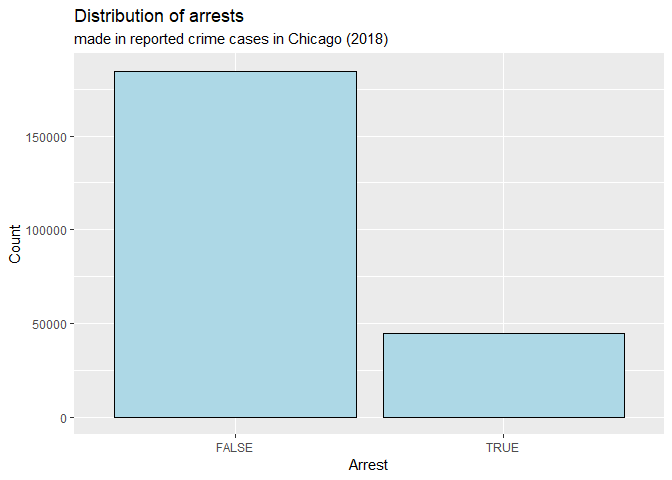
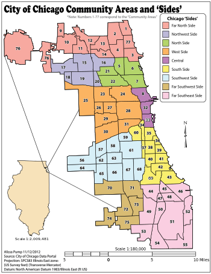

What factors can be used to predict arrests in the city of Chicago?
================
Team Alphas
12/6/2018

Introduction
------------

Since 1990, crime rates in the 30 biggest cities in America has dropped 64%. However, from 2014 to 2016, crime rates across America rose significantly, with the biggest increase in violent crime (10.6% rise from 2014 to 2015). This crime problem was addressed by Donald Trump in his 2016 presidential run, and a big part of his "Make America Great Again" campaign.

Of course, it is extremely important that our policymakers and law enforcement officials do their best to keep the American public safe. Of equal importance to reducing crime is making arrests when crime does occur. We can use data science to help us begin to tackle this issue.

By looking at data on crimes and arrests, we can identify the factors that are the biggest indicators to predicting whether an arrest is made. Using insights gained from this analysis, we can make the criminal justice system more efficient/effective in arresting and prosecuting criminals or reducing crime rates. For example, if one trend in the data shows a disproportionately low amount of arrests being made during the winter months, a city can increase the number of officers on patrol during winter. In addition, if another trend in the data is showing a very small proportion of arrests being made in domestic violence cases as compared to other crime types, then a city can make changes to the way domestic violence crimes are reported to and processed by law enforcement. Consequently, if more arrests are made, this may deter criminals from committing a crime in the future, lowering crime rates. Essentially, looking at which factors are attributed to an arrest can allow law enforcement and policymakers to see the strengths and weaknesses of the current system, and act to improve it accordingly.

For the purposes of data analysis, in this project we will focus specifically on crime statistics in Chicago, since there is not enough data to accurately predict uniform crime trends across the US. As one of the largest cities in the US, Chicago also has one of the highest rates of crime in the US, meaning that it will be a relevant microcosm for us to conduct our study.

Thus, in this project, we will be answering the question: What factors are the biggest indicators to predict arrests in the city of Chicago? Specifically, we will be analyzing and focusing on the factors in the dataset that are attributed to the highest proportion of arrests.

The dataset we will be looking at to investigate this question is the "Crimes - 2018" dataset from the Chicago Data Portal. The data itself is a csv file with 229,359 observations across 22 variables; and the 2018 data is a subset of the larger "Crimes - 2001 to present" original dataset. The data were collected from the Chicago Police Department's CLEAR (Citizen Law Enforcement Analysis and Reporting) system. Each observation in the dataset is a separate reported crime that was committed in the city of Chicago in 2018, while the variables contain information about the reported crime, such as time, location, type of crime, etc.

Data Analysis
-------------

First, let's load the dataset into R.

For our analysis, we will primarily be using the `Arrest` variable, which is coded as True/False, as our response variable. Let's take a look at the initial distribution of this variable.

    ## # A tibble: 2 x 2
    ##   Arrest  prop
    ##   <lgl>  <dbl>
    ## 1 FALSE   80.5
    ## 2 TRUE    19.5

From the visualization above, it is clear that for the vast majority of reported crime cases, there is no arrest made (~80%). Thus, we are very interested in determining the factors that are associated with an arrest. For the purposes of simplicity and efficiency in our data analysis, we will only focus on the variables `Date`, `Primary.Type`, `Location.Description`, `Domestic`, and `Community.Area` for our explanatory variables.

First, let's explore the `Date` variable.

    ##  chr [1:229359] "11/10/2018 19:11" "11/10/2018 1:39" "11/3/2018 0:00" ...

However, we need to do a couple touch-ups before beginning our data analysis process. Since the `Date` variable is coded with both the date of the crime as well as the time it was committed, we can separate the `Date` variable into two new variables: the month of the crime as well as the time of the crime. This will help break down the original complex `Date` variable.

With our new variables `month` and `time` created, we now have the framework with which we can begin our data analysis. However, due to the many levels and subsequent level of specificity (to a degree which is unnecessary for the purposes of our data analysis) introduced by both the new variables, we can still break down our data further. We can introduce a new `season` variable to reduce the number of levels introduced by `month` by grouping January and February under "Winter", March, April and May under "Spring", June, July, and August under "Summer", and September, October, and November under "Fall". In addition, we can create a new `daytime` logical variable which indicates whether the crime was committed during daytime hours or not. For simplicity, we will classify daytime hours as between 6AM and 6PM (6:00 - 18:00).

Now let's take a look at our `Community Area` variable. Similarly as we have done with the `month` and `time` variables to reduce the number levels, we can also simplify the `Community Area` variable by creating a new variable `side`, which classifies all 77 community areas as one "neighborhood" or "side" of Chicago in accordance to the map below:

Finally, let's take a look at our `Primary Type` and `Location Description` variables, which both have many levels. For our data analysis, we will only focus on the main elements of each to increase both the relevance of our findings as well as the organization and efficiency of our analysis. For `Primary Type` (crime type), we will only be focusing on the crime types of assault, battery, criminal sexual assault, homicide, robbery, theft, and other offense.

For `Location Description`, we will only be focusing on the top five locations where the most incidences of crime occurred - Street, Residence, Apartment, Sidewalk, and Other.

    ## Selecting by n

    ## # A tibble: 5 x 2
    ##   `Location Description`     n
    ##   <chr>                  <int>
    ## 1 STREET                 51128
    ## 2 RESIDENCE              37894
    ## 3 APARTMENT              29248
    ## 4 SIDEWALK               18635
    ## 5 OTHER                   9173

Now, we can filter for only levels of `Primary Type` and `Location Description` we are interested in and put that data in a new dataframe with which we will conduct our analysis. This also cuts down the extremely large number of observations we had to begin with.

    ## Observations: 88,051
    ## Variables: 10
    ## $ `Case Number`          <chr> "JB511275", "JB508160", "JB518326", "JB...
    ## $ `Primary Type`         <chr> "HOMICIDE", "THEFT", "OTHER OFFENSE", "...
    ## $ `Location Description` <chr> "APARTMENT", "STREET", "STREET", "RESID...
    ## $ Arrest                 <lgl> FALSE, FALSE, FALSE, FALSE, FALSE, FALS...
    ## $ Domestic               <lgl> FALSE, FALSE, FALSE, FALSE, FALSE, TRUE...
    ## $ month                  <chr> "November", "November", "November", "No...
    ## $ time                   <chr> "19:11", "10:00", "9:00", "9:00", "23:0...
    ## $ season                 <chr> "Fall", "Fall", "Fall", "Fall", "Fall",...
    ## $ daytime                <lgl> FALSE, TRUE, TRUE, TRUE, FALSE, FALSE, ...
    ## $ side                   <chr> "Southwest", "Far Southwest", "South", ...

With our new crimesdata dataset created, we can begin our analysis process. For our logistic regression, our response variable is the binary `Arrest` variable, coded as True/False, and we are interested in cases where an arrest has been made (`Arrest` = True). Our explanatory variables will be `Primary Type`, `Location Description`, season, daytime, side, and Domestic.

Let's start by creating our full logistic regression model.

    ## 
    ## Call:
    ## glm(formula = Arrest ~ season + daytime + Domestic + `Primary Type` + 
    ##     `Location Description` + side, family = "binomial", data = crimesdata)
    ## 
    ## Deviance Residuals: 
    ##     Min       1Q   Median       3Q      Max  
    ## -0.9732  -0.6299  -0.4684  -0.2332   2.9446  
    ## 
    ## Coefficients:
    ##                                   Estimate Std. Error z value Pr(>|z|)    
    ## (Intercept)                       -1.71830    0.06355 -27.038  < 2e-16 ***
    ## seasonSpring                       0.07953    0.02990   2.660 0.007821 ** 
    ## seasonSummer                       0.05760    0.02922   1.972 0.048658 *  
    ## seasonWinter                       0.22444    0.03403   6.596 4.24e-11 ***
    ## daytimeTRUE                       -0.16991    0.02129  -7.983 1.43e-15 ***
    ## DomesticTRUE                       0.04086    0.02477   1.649 0.099079 .  
    ## `Primary Type`BATTERY              0.34531    0.03107  11.114  < 2e-16 ***
    ## `Primary Type`CRIM SEXUAL ASSAULT -0.90751    0.14895  -6.093 1.11e-09 ***
    ## `Primary Type`HOMICIDE            -0.11449    0.15519  -0.738 0.460675    
    ## `Primary Type`OTHER OFFENSE        0.41840    0.03618  11.565  < 2e-16 ***
    ## `Primary Type`ROBBERY             -1.23121    0.06508 -18.919  < 2e-16 ***
    ## `Primary Type`THEFT               -1.85263    0.04808 -38.533  < 2e-16 ***
    ## `Location Description`OTHER       -0.37754    0.05870  -6.432 1.26e-10 ***
    ## `Location Description`RESIDENCE   -0.38983    0.03085 -12.636  < 2e-16 ***
    ## `Location Description`SIDEWALK     0.25440    0.03535   7.197 6.13e-13 ***
    ## `Location Description`STREET       0.28366    0.03104   9.139  < 2e-16 ***
    ## sideFar North                     -0.11313    0.06062  -1.866 0.062001 .  
    ## sideFar Southeast                  0.24947    0.05612   4.445 8.79e-06 ***
    ## sideFar Southwest                  0.02769    0.06198   0.447 0.655074    
    ## sideNorth                         -0.18419    0.06767  -2.722 0.006492 ** 
    ## sideNorthwest                     -0.20103    0.06707  -2.997 0.002725 ** 
    ## sideSouth                         -0.06635    0.05462  -1.215 0.224476    
    ## sideSouthwest                      0.02195    0.05446   0.403 0.686889    
    ## sideWest                          -0.19156    0.05213  -3.675 0.000238 ***
    ## ---
    ## Signif. codes:  0 '***' 0.001 '**' 0.01 '*' 0.05 '.' 0.1 ' ' 1
    ## 
    ## (Dispersion parameter for binomial family taken to be 1)
    ## 
    ##     Null deviance: 66161  on 85737  degrees of freedom
    ## Residual deviance: 60283  on 85714  degrees of freedom
    ##   (2313 observations deleted due to missingness)
    ## AIC: 60331
    ## 
    ## Number of Fisher Scoring iterations: 6

From our full model, we can see that there are many coefficients in our original logistic regression. We can perform backward model selection on this model to try and choose a better model with a lower AIC.

    ## [1] 60330.77

    ## Start:  AIC=60330.77
    ## Arrest ~ season + daytime + Domestic + `Primary Type` + `Location Description` + 
    ##     side
    ## 
    ##                          Df Deviance   AIC
    ## <none>                         60283 60331
    ## - Domestic                1    60285 60331
    ## - season                  3    60328 60370
    ## - daytime                 1    60346 60392
    ## - side                    8    60460 60492
    ## - `Location Description`  4    60882 60922
    ## - `Primary Type`          6    64769 64805

    ## # A tibble: 24 x 5
    ##    term                              estimate std.error statistic   p.value
    ##    <chr>                                <dbl>     <dbl>     <dbl>     <dbl>
    ##  1 (Intercept)                        -1.72      0.0636   -27.0   5.29e-161
    ##  2 seasonSpring                        0.0795    0.0299     2.66  7.82e-  3
    ##  3 seasonSummer                        0.0576    0.0292     1.97  4.87e-  2
    ##  4 seasonWinter                        0.224     0.0340     6.60  4.24e- 11
    ##  5 daytimeTRUE                        -0.170     0.0213    -7.98  1.43e- 15
    ##  6 DomesticTRUE                        0.0409    0.0248     1.65  9.91e-  2
    ##  7 `Primary Type`BATTERY               0.345     0.0311    11.1   1.07e- 28
    ##  8 `Primary Type`CRIM SEXUAL ASSAULT  -0.908     0.149     -6.09  1.11e-  9
    ##  9 `Primary Type`HOMICIDE             -0.114     0.155     -0.738 4.61e-  1
    ## 10 `Primary Type`OTHER OFFENSE         0.418     0.0362    11.6   6.17e- 31
    ## # ... with 14 more rows

From the results of our backwards AIC model selection, our original full model is still the best logistic regression model of our results. This can be explained by the fact that most of our variables had multiple levels, and removing that variable from the full model would also lose a lot of specificity and diversity in the data, thereby increasing the AIC.

Knowing this, we can look at the coefficients of our full logistic regression model to get a better idea of which factors influence our response variables the most. Looking at the p-values for which specific coefficients are statistically significant can help us determine the factors that influence an arrest.

However, the current coefficients of our full logistic regression model are the increase in log odds for an arrest being made per change in explanatory variable, which is quite hard to conceptualize. Instead, we can exponentiate the coefficients to make them easier to understand.

    ##                       (Intercept)                      seasonSpring 
    ##                         0.1793707                         1.0827820 
    ##                      seasonSummer                      seasonWinter 
    ##                         1.0592940                         1.2516249 
    ##                       daytimeTRUE                      DomesticTRUE 
    ##                         0.8437371                         1.0417042 
    ##             `Primary Type`BATTERY `Primary Type`CRIM SEXUAL ASSAULT 
    ##                         1.4124294                         0.4035286 
    ##            `Primary Type`HOMICIDE       `Primary Type`OTHER OFFENSE 
    ##                         0.8918221                         1.5195316 
    ##             `Primary Type`ROBBERY               `Primary Type`THEFT 
    ##                         0.2919377                         0.1568244 
    ##       `Location Description`OTHER   `Location Description`RESIDENCE 
    ##                         0.6855464                         0.6771721 
    ##    `Location Description`SIDEWALK      `Location Description`STREET 
    ##                         1.2896923                         1.3279855 
    ##                     sideFar North                 sideFar Southeast 
    ##                         0.8930343                         1.2833433 
    ##                 sideFar Southwest                         sideNorth 
    ##                         1.0280759                         0.8317736 
    ##                     sideNorthwest                         sideSouth 
    ##                         0.8178855                         0.9358023 
    ##                     sideSouthwest                          sideWest 
    ##                         1.0221950                         0.8256727

To begin, let's look at the `season` variable. From the summary output, we see that the odds of a criminal being arrested increase by a factor of 1.08 if they commit a crime in the spring, 1.06 if they commit a crime in the summer, and over 1.25 if they commit a crime in the winter compared to when they commit a crime in the fall. However, out of these three seasons, only winter seems to have a coefficient and subsequent p-value that is small enough to be statistically significant. If we recall from earlier, January and February are the months to which we assigned the season winter. Let's take a look at the relative arrest rates in these two months compared to the yearly average (when looking at proportions of arrests made, we still use our original crimes dataset because are interested in the proportions of arrests made in the rest of the population data).

    ## # A tibble: 2 x 4
    ## # Groups:   month [2]
    ##   month    Arrest     n prop 
    ##   <chr>    <lgl>  <int> <chr>
    ## 1 February TRUE    3837 22.3%
    ## 2 January  TRUE    4148 20.5%

    ## # A tibble: 1 x 2
    ##   Arrest  prop
    ##   <lgl>  <dbl>
    ## 1 TRUE    19.5

It appears that there are a significantly higher proportion of arrests made in January and February, indicating that a criminal is much more likely to be arrested if they commit a crime in the early months of the year.

Next, let's take a look at the `daytime` variable. According to the output, the odds of a criminal being arrested for a crime committed between 6AM and 6PM are around 0.16 less compared to a crime committed between 7PM and 5AM. This is pretty surprising, given that one would expect there to be less police presence during night hours.

    ## # A tibble: 2 x 4
    ## # Groups:   daytime [2]
    ##   daytime Arrest     n prop 
    ##   <lgl>   <lgl>  <int> <chr>
    ## 1 FALSE   TRUE   19002 20.5%
    ## 2 TRUE    TRUE   25712 18.8%

    ## # A tibble: 1 x 2
    ##   Arrest  prop
    ##   <lgl>  <dbl>
    ## 1 TRUE    19.5

From the output above, one can clearly see that there is a significantly higher proportion of arrests made of crimes committed during nighttime, over 1% higher than the overall average, whereas the proportion of crimes committed during the day is lower by nearly 1% (around 0.7%). Thus, a criminal is more likely to be arrested if they commit a crime at night (specifically between 7PM and 5AM).

Next up is the `Domestic` variable. From the summary output, we can see that the p-value for the DomesticTRUE coefficient is not statistically significant, and that is also reflected in the backwards model selection. Although AIC did increase with the removal of the `Domestic` variable, it increased by less than 1, meaning that the difference in the suitability of the two models was very small. From the coefficient, we can see the log odds of a criminal being arrested for a domestic crime is around 0.04 greater than if the crime was not domestic.

Now, let's take a look at the `Primary Type` variable. From the summary output, almost all of the coefficients are statistically significant. Specifically, the odds of a criminal being arrested for battery are a factor of 1.41 greater than being arrested for assault. Similarly, it is 0.60 less for criminal sexual assault, 0.11 less for homicide, 1.52 greater for other offense, 0.71 less for robbery and over 0.84 less for theft.

    ## # A tibble: 7 x 4
    ## # Groups:   Primary Type [7]
    ##   `Primary Type`      Arrest     n  prop
    ##   <chr>               <lgl>  <int> <dbl>
    ## 1 BATTERY             TRUE    8659 19.9 
    ## 2 OTHER OFFENSE       TRUE    2919 19.8 
    ## 3 HOMICIDE            TRUE      93 18.6 
    ## 4 ASSAULT             TRUE    2861 16.1 
    ## 5 THEFT               TRUE    5330  9.57
    ## 6 ROBBERY             TRUE     621  7.44
    ## 7 CRIM SEXUAL ASSAULT TRUE      71  5.21

    ## # A tibble: 1 x 2
    ##   Arrest  prop
    ##   <lgl>  <dbl>
    ## 1 TRUE    19.5

From the output, the three numbers that are immediately noticeable are the extremely low arrest percentages for theft, robbery, and criminal sexual assault, all of which are less than 10%. It appears that a criminal is most likely to be arrested if they commit battery or some other minor offense.

Next, let's look at the `Location Description` variable. From the summary output, all of the coefficients appear to be statistically significant, with the odds of an arrest for a crime committed in a residence a factor of 0.32 lower than for a crime commmitted in an apartment, 1.28 higher for a crime committed on a sidewalk, 1.32 higher for a crime committed on a street, and 0.31 lower for a crime committed in some other location.

    ## # A tibble: 5 x 4
    ## # Groups:   Location Description [5]
    ##   `Location Description` Arrest     n  prop
    ##   <chr>                  <lgl>  <int> <dbl>
    ## 1 SIDEWALK               TRUE    6957 37.3 
    ## 2 STREET                 TRUE   10675 20.9 
    ## 3 APARTMENT              TRUE    4139 14.2 
    ## 4 RESIDENCE              TRUE    4143 10.9 
    ## 5 OTHER                  TRUE     847  9.23

    ## # A tibble: 1 x 2
    ##   Arrest  prop
    ##   <lgl>  <dbl>
    ## 1 TRUE    19.5

As the output above confirms, criminals are much more likely to get arrested if they commit a crime outdoors on a sidewalk or street than if they commit a crime in a private residence or apartment.

Finally, let's take a look at the `side` variable. From the summary output, only a few of the coefficients were statistically significant. Specifically, the odds of a criminal being arrested for committing a crime in the Far Southeast side of Chicago are a factor of 1.28 higher than committing a crime in Central Chicago. Similarly, the odds are a factor of 0.17 lower for the North Side, 0.19 lower for the Northwest side, and 1.18 higher for the West Side.

This makes sense as we would expect there to be a lot heavier police presence concentrated near the South and West Side of Chicago, as there are a significantly greater number of crimes in that region.

    ## # A tibble: 9 x 4
    ## # Groups:   side [9]
    ##   side          Arrest     n prop 
    ##   <chr>         <lgl>  <int> <chr>
    ## 1 West          TRUE   14763 25.8%
    ## 2 Far Southeast TRUE    4691 22.5%
    ## 3 Southwest     TRUE    6195 20.4%
    ## 4 Far Southwest TRUE    2742 19.2%
    ## 5 South         TRUE    5427 18.1%
    ## 6 Central       TRUE    3308 14.9%
    ## 7 Far North     TRUE    2829 13.9%
    ## 8 Northwest     TRUE    1578 13.3%
    ## 9 North         TRUE    1860 11.2%

    ## # A tibble: 1 x 2
    ##   Arrest  prop
    ##   <lgl>  <dbl>
    ## 1 TRUE    19.5

As expected, the highest proportion of arrests made are for crimes committed in the West and Far Southeast sides of Chicago.

Conclusion
----------

Overall, an arrest is likely to be made if the crime occurred during January and February, the crime was committed during daylight hours, the crime was a battery or other minor offense, the crime was committed outdoors, or if the crime was committed in the West or Far Southeast side of Chicago.

From this data analysis, we can conclude that to increase the proportion of arrests made overall, city officials and police departments can work to increase the number of arrests made later on in the year, especially during summer (a possible mid-year lull), increase police activity during daylight hours, reform the way arrests for violent or serious crimes are made, increase efficiency in dealing with crimes committed in private residences, and increase police activity and presence in the North region of Chicago.
