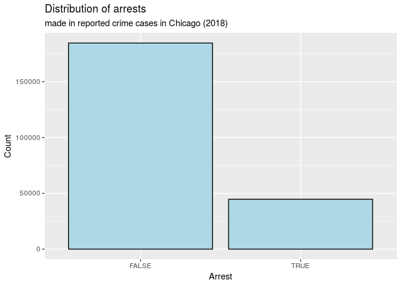

What factors can be used to predict arrests in the city of Chicago?
================
Team Alphas
11/19/2018

``` r
library(tidyverse)
```

## Section 1. Introduction

Since 1990, crime rates in the 30 biggest cities in America has dropped
64%. However, from 2014 to 2016, crime rates across America rose
significantly, with the biggest increase in violent crime (10.6% rise
from 2014 to 2015). This crime problem was addressed by Donald Trump in
his 2016 presidential run, and a big part of his “Make America Great
Again” campaign.

Of course, it is extremely important that our policymakers and law
enforcement officials do their best to keep the American public safe. Of
equal importance to reducing crime is making arrests when crime does
occur. We can use data science to help us begin to tackle this issue.

By looking at data on crimes and arrests, we can identify the factors
that are the biggest indicators to predicting whether an arrest is made.
Using insights gained from this analysis, we can make the criminal
justice system more efficient/effective in arresting and prosecuting
criminals or reducing crime rates. For example, if one trend in the data
shows a disproportionately low amount of arrests being made during the
winter months, a city can increase the number of officers on patrol
during winter. In addition, if another trend in the data is showing a
very small proportion of arrests being made in domestic violence cases
as compared to other crime types, then a city can make changes to the
way domestic violence crimes are reported to and processed by law
enforcement. Consequently, if more arrests are made, this may deter
criminals from committing a crime in the future, lowering crime rates.
Essentially, looking at which factors are attributed to an arrest can
allow law enforcement and policymakers to see the strengths and
weaknesses of the current system, and act to improve it accordingly.

For the purposes of data analysis, in this project we will focus
specifically on crime statistics in Chicago, since there is not enough
data to accurately predict uniform crime trends across the US. As one of
the largest cities in the US, Chicago also has one of the highest rates
of crime in the US, meaning that it will be a relevant microcosm for us
to conduct our study.

Thus, in this project, we will be answering the question: What factors
are the biggest indicators to predict arrests in the city of Chicago?
Specifically, we will be analyzing and focusing on the factors in the
dataset that are attributed to the highest proportion of arrests.

The dataset we will be looking at to investigate this question is the
“Crimes - 2018” dataset from the Chicago Data Portal. The data itself
is a csv file with 229,359 observations across 22 variables; and the
2018 data is a subset of the larger “Crimes - 2001 to present” original
dataset. The data were collected from the Chicago Police Department’s
CLEAR (Citizen Law Enforcement Analysis and Reporting) system. Each
observation in the dataset is a separate reported crime that was
committed in the city of Chicago in 2018, while the variables contain
information about the reported crime, such as time, location, type of
crime, etc.

## Section 2. Data analysis plan

First, let’s load the dataset into R.

``` r
crimes <- read_csv(file = "../data/Crimes - 2018.csv")
```

For our analysis, we will primarily be using the `Arrest` variable,
which is coded as True/False, as our response variable. Let’s take a
look at the initial distribution of this variable.

``` r
ggplot(data = crimes, mapping = aes(x = Arrest)) +
  geom_bar(stat = "count", fill = "Light Blue", color = "Black") +
  labs(title = "Distribution of arrests",
       subtitle = "made in reported crime cases in Chicago (2018)",
       y = "Count")
```

<!-- -->

``` r
crimes %>%
  select(Arrest) %>%
  count(Arrest) %>% 
  group_by(Arrest) %>%
  summarise(prop = 100*(n/nrow(crimes)))
```

    ## # A tibble: 2 x 2
    ##   Arrest  prop
    ##   <lgl>  <dbl>
    ## 1 FALSE   80.5
    ## 2 TRUE    19.5

From the visualization above, it is clear that for the vast majority of
reported crime cases, there is no arrest made (~80%). Thus, we are very
interested in determining the factors that are associated with an
arrest. For the purposes of simplicity and efficiency in our data
analysis, we will only focus on the variables `Date`, `Primary.Type`,
`Location.Description`, `Domestic`, and `Community.Area` for our
explanatory variables.

Next, a couple of touch-ups before we can actually start our analysis
process.

``` r
glimpse(crimes$Date)
```

    ##  chr [1:229359] "11/10/2018 19:11" "11/10/2018 1:39" "11/3/2018 0:00" ...

Since the `Date` variable is coded with both the date of the crime as
well as the time it was committed, we can separate the `Date` variable
into two new variables: the date of the crime as well as the time of the
crime. This will help introduce more specificity and break down the
original complex `Date` variable.

For the actual data analysis process, for each explanatory variable
(with the exception of `Community.Area`), we will separate the data into
several blocs, with each bloc representing the section of the data
corresponding to each level of that variable (since all of our
explanatory variables are categorical). Next, we can conduct hypothesis
testing to see if each factor is an influential determinant on the
outcome of the `Arrest` variable.

For example, once we create the new `simpleDate` and `TimeofDay`
variables, we can separate the dataset into two blocs: one half will be
all the crimes committed during the daylight hours - 6am to 6pm, while
the others will be for crimes committed at night. Next, we can conduct a
hypothesis test for independence for the proportion of arrests made in
each of these subsets to see if the time of day is a statistically
significant factor in determining whether a an arrest is made.

Of course, we will then do this for all of the following variables.
Since the `Community.Area` variable has too many levels, we can group
nearby community areas together. We will do this by incorporating the
map of commmunity areas in Chicago - for example, community areas 5, 6,
7, 21, and 22 are commonly grouped together into what is referred to as
the “North Side” of the city. Thus, we can create a new variable called
`side` and categorize all the remaining community areas into one of the
“Far North Side”, “Northwest Side”, “West Side”, “Central”, “South
Side”, “Southwest Side”, “Far Southwest Side”, or “Far Southeast Side”.
We can then visualize the distribution, and compare the proportions of
arrests across different regions of the city graphically instead of
conducting hypothesis tests.

Thus, after performing our data analysis, we will be able to find a
comprehensive set of all the factors that are most useful in determining
whether an arrest is made in the city of Chicago.

## Section 3. Data

``` r
glimpse(crimes)
```

    ## Observations: 229,359
    ## Variables: 22
    ## $ ID                     <int> 24287, 24286, 11509800, 11509772, 11509...
    ## $ `Case Number`          <chr> "JB511275", "JB510461", "JB519197", "JB...
    ## $ Date                   <chr> "11/10/2018 19:11", "11/10/2018 1:39", ...
    ## $ Block                  <chr> "056XX S GREEN ST", "102XX S STATE ST",...
    ## $ IUCR                   <chr> "110", "110", "1206", "820", "1110", "5...
    ## $ `Primary Type`         <chr> "HOMICIDE", "HOMICIDE", "DECEPTIVE PRAC...
    ## $ Description            <chr> "FIRST DEGREE MURDER", "FIRST DEGREE MU...
    ## $ `Location Description` <chr> "APARTMENT", "RESTAURANT", "OTHER", "ST...
    ## $ Arrest                 <lgl> FALSE, FALSE, FALSE, FALSE, FALSE, FALS...
    ## $ Domestic               <lgl> FALSE, FALSE, FALSE, FALSE, FALSE, FALS...
    ## $ Beat                   <int> 712, 511, 1932, 621, 2032, 1622, 231, 4...
    ## $ District               <int> 7, 5, 19, 6, 20, 16, 2, 4, 8, 25, 11, 2...
    ## $ Ward                   <int> 20, 9, 43, 17, 47, 45, 3, 8, 18, 36, 28...
    ## $ `Community Area`       <int> 68, 49, 7, 71, 3, 10, 40, 43, 66, 19, 2...
    ## $ `FBI Code`             <chr> "01A", "01A", "11", "6", "11", "08A", "...
    ## $ `X Coordinate`         <int> 1171600, 1178064, NA, NA, NA, NA, NA, N...
    ## $ `Y Coordinate`         <int> 1867481, 1836832, NA, NA, NA, NA, NA, N...
    ## $ Year                   <int> 2018, 2018, 2018, 2018, 2018, 2018, 201...
    ## $ `Updated On`           <chr> "11/17/2018 16:14", "11/17/2018 16:14",...
    ## $ Latitude               <dbl> 41.79183, 41.70758, NA, NA, NA, NA, NA,...
    ## $ Longitude              <dbl> -87.64631, -87.62353, NA, NA, NA, NA, N...
    ## $ Location               <chr> "(41.791827281, -87.646308595)", "(41.7...

## References:

Link to dataset:

<https://data.cityofchicago.org/Public-Safety/Crimes-2018/3i3m-jwuy>

Other
sources/statistics:

<https://www.brennancenter.org/issues/crime-rates-america>

<https://www.statista.com/statistics/191129/reported-violent-crime-in-the-us-since-1990/>

<http://www.thechicago77.com/chicago-neighborhoods/>
